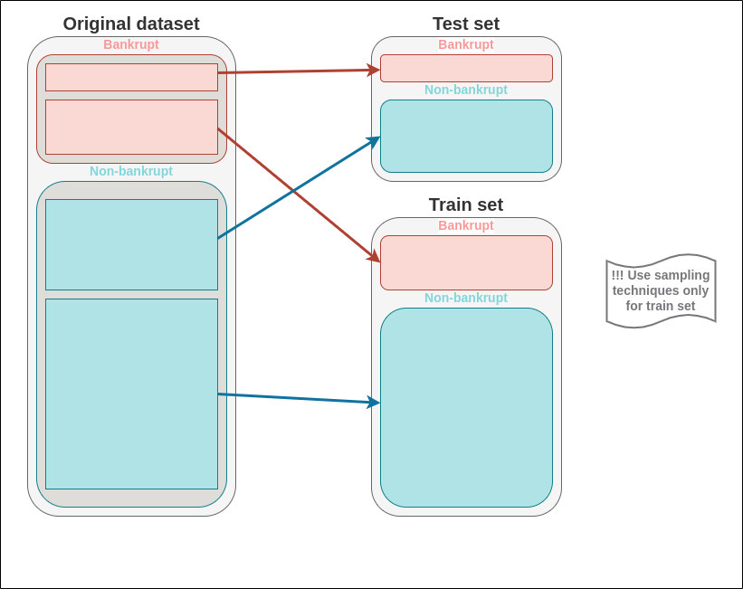

# Bankruptcy Prediction

## Data
The dataset consists of:
* independent variables: financial indicators (~95) for selected Taiwan Companies (~6800)
* label: information whether company went bankrupt or not.

## Source
Data comes from the Taiwan Economic Journal including period of 1999–2009.

## Kaggle:
https://www.kaggle.com/datasets/fedesoriano/company-bankruptcy-prediction

## Task
* Build an optimal classifier for bankruptcy prediction.

## Challenges
* Low data quality (irrelevant data in some columns, highly correlated columns)
* Unbalanced data (classes distribution is ~1/30)

## Pipeline
1. Data exploration
2. Data preprocessing (data cleaning, remove correlated columns, oversampling)

3. ML

Find optimal hyperparameters for:

3.1. Random Forrest
3.2. XGBoost
3.3. LightGBM

4. Summary
